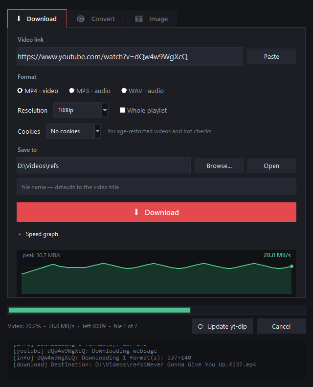
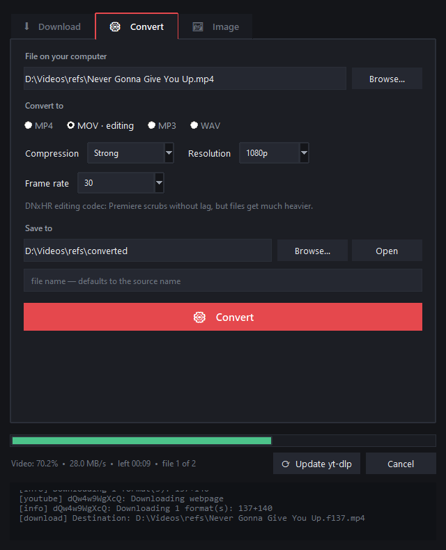
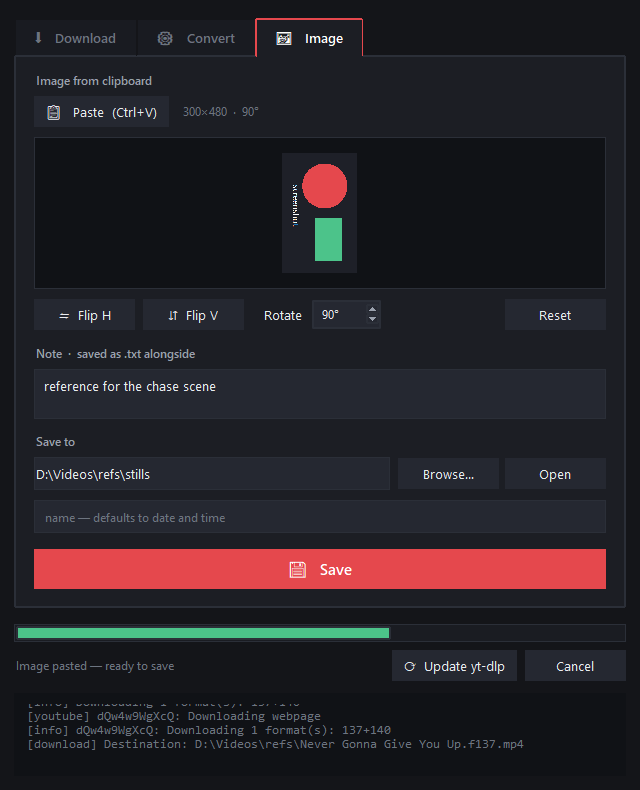

# YT-DLP GUI

A Windows desktop front-end for [yt-dlp](https://github.com/yt-dlp/yt-dlp) and
ffmpeg: download videos, re-encode them for editing, and save screenshots from
the clipboard — all from one window.

Written in Python with tkinter. Ships as a **single self-contained `.exe` with
yt-dlp built in**, so whoever you hand it to installs nothing.



---

## What it does

### ⬇ Download

Paste a link, pick a format, press Download.

- **MP4, MP3 or WAV**, resolution up to 4K
- Resolution is measured on the **shorter side of the frame**, so vertical
  videos (Shorts, 9:16) are not silently downgraded
- Prefers **h264/aac** on a quality tie — those files open everywhere, unlike
  the AV1 that YouTube hands out by default, which makes editors crawl
- **Cookies from your browser** for age-restricted videos and "confirm you're
  not a bot" checks
- Whole playlists, custom file name, and the output folder is remembered
- **Its own speed and time-left maths.** yt-dlp's own ETA is per-file and
  restarts when it moves from video to audio; here speed is averaged over a
  six-second window and the status names the stage:
  `Video: 70.2% · 28.0 MB/s · left 00:09 · file 1 of 2 · video 3 of 12`
- **Speed graph** in a spoiler that expands under the button
- **Update yt-dlp** button — YouTube breaks compatibility every few months and
  this saves a trip to the terminal

### ⚙ Convert



- Any local file → **MP4 / MOV / MP3 / WAV**
- Four compression levels, resolution and frame-rate changes
- **MOV (editing)** writes DNxHR: every frame is self-contained, so Premiere
  and Resolve scrub the timeline without lag
- A one-click hint offers the file you just downloaded, so you never retype a
  path

### 🖼 Image



- Paste a screenshot with **Ctrl+V**, then flip and rotate it
- A note is saved into a `.txt` next to the picture
- Transforms are pure standard library, done with byte slices rather than
  per-pixel loops: a flip or a rotation of a 1920×1080 frame takes **4–13 ms**

### Drag and drop

Drop things anywhere on the window and the app sorts them out: a **link** goes
to Download, a **video or audio file** goes to Convert, an **image** opens on
the Image tab. The tab you dropped onto does not matter.

---

## Get it

### Ready-made build

Grab `YT-DLP-GUI.zip` from the repository
[Releases](https://github.com/triezo/YTDLP_soft/releases), unpack, run
`YT-DLP GUI.exe`. Nothing else to install.

Windows will show a SmartScreen warning on first launch — the app simply is not
code-signed. Click **More info → Run anyway**.

### Run from source

```bash
git clone https://github.com/triezo/YTDLP_soft.git
cd YTDLP_soft
pip install yt-dlp tkinterdnd2
pythonw ytdlp_gui.pyw
```

Needs Python 3 with tkinter (the installer from python.org includes it).
`tkinterdnd2` is optional — without it everything works except drag-and-drop.

Or just double-click `YT-DLP GUI.bat`.

### Build the exe yourself

```bash
pip install pyinstaller
build_exe.bat
```

Output is `dist/YT-DLP GUI.exe`, about 24 MB, with Python, tkinter, yt-dlp and
tkinterdnd2 inside. The exe doubles as yt-dlp: it re-launches itself with an
internal flag instead of calling an external binary.

---

## ffmpeg

ffmpeg is **not bundled** — the official Windows builds are over 200 MB per
binary, which would dwarf the app itself.

It is needed to merge 1080p and above, to produce MP3/WAV, for the whole
Convert tab, and to read non-PNG images. Without it you still get plain
medium-quality video, and the app says so on startup instead of failing later.

Install it either way:

```bash
winget install Gyan.FFmpeg
```

…or drop `ffmpeg.exe` and `ffprobe.exe` next to `YT-DLP GUI.exe` (an `ffmpeg`
subfolder works too). The app searches beside itself, then PATH, then the usual
install locations.

To hand someone a build that works with zero setup, zip the exe together with
those two binaries and `README.txt`.

---

## Tests

```bash
python tests/run_all.py
```

Eleven tests that open real windows and drive real ffmpeg, so they take a
minute rather than a second. They cover the speed and time-left maths, the
playlist counter, image transforms pixel by pixel, drag-and-drop payloads,
focus highlighting, removal of half-written files on cancel, and the fact that
closing the window does not leave yt-dlp or ffmpeg running in the background.

---

## Settings

Last used folders, the cookies choice and the graph spoiler state live in the
registry under `HKCU\Software\ytdlp-gui`. Nothing is written next to the exe,
so it runs fine from a read-only location.

## Licence

Uses [yt-dlp](https://github.com/yt-dlp/yt-dlp) (Unlicense) and
[ffmpeg](https://ffmpeg.org/).
